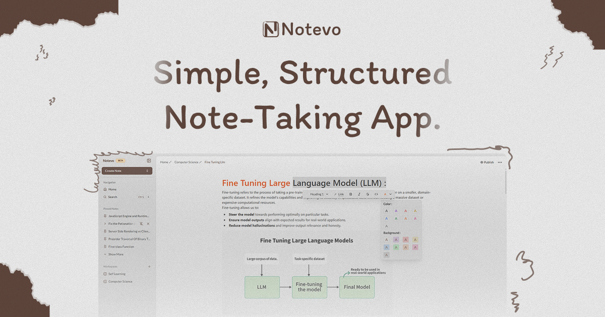

# Notevo
 
 **Notevo** is an AI-powered, real-time note-taking SaaS platform designed to help users create, edit, and organize their notes seamlessly. With a Notion-style WYSIWYG editor, users can enjoy a rich-text editing experience and leverage AI to improve productivity through intelligent suggestions and auto-completion.
 
 ## To Do :
 
 [!Done] fix the routing
 
 [] fix the middleware
 
 [] fix the code Highlight in the editer
 
 [!Done] fix the caching
 
 [!Done] change the rename stff in the workingspace route
 
 
 
 
 ## Features
 
 - 📝 **Notion-style editor** powered by Novel
 - 🤖 **AI-powered autocompletion** with OpenAI integration
 - 🔄 **Real-time updates**
 - 📂 **Cloud storage support with Convex**
 - 🔐 **Authentication with Convex**
 - 🚀 **Optimized performance** with Convex
 - 🌍 **Deployed on Vercel** for seamless access
 
 ## Tech Stack
 
 - **Frontend:** Next.js, React, TypeScript, Tailwind CSS
 - **Backend:** Convex
 - **AI Integration:** OpenAI API, Vercel AI SDK
 - **Editor:** Tiptap (Novel)
 - **Deployment:** Vercel
 
 ## Getting Started
 
 ### Prerequisites
 Make sure you have the following installed:
 - Node.js 18+
 - Convex CLI (for backend development)
 - Vercel CLI (optional, for deployment)
 
 ### Installation
 ```bash
 git clone https://github.com/imohammedh/Notevo.git
 cd Notevo
 pnpm install  # or npm install
 ```
 
 ### Environment Variables
 Create a `.env` file and add the following:
 ```env
 CONVEX_DEPLOY_KEY=your_convex_deploy_key
 OPENAI_API_KEY=your_openai_key
 ```
 
 ### Running Locally
 ```bash
 pnpm dev  # or npm run dev
 ```
 Then, open [http://localhost:3000](http://localhost:3000) in your browser.
 
 ## Deployment
 Deploy on Vercel:
 ```bash
 vercel deploy
 ```
 
 ## Contributing
 We appreciate contributions to Notevo! Follow these steps to contribute:
 
 1. **Fork the Repository**
    - Click the 'Fork' button at the top right of the repository page on GitHub.
 
 2. **Clone Your Fork**
    ```bash
    git clone https://github.com/your-username/Notevo.git
    cd Notevo
    ```
 
 3. **Create a New Branch**
    ```bash
    git checkout -b feature-name
    ```
 
 4. **Make Changes**
    - Implement your feature or fix the bug.
    - Commit your changes with a descriptive message.
    ```bash
    git commit -m "Add feature XYZ"
    ```
 
 5. **Push Your Branch**
    ```bash
    git push origin feature-name
    ```
 
 6. **Submit a Pull Request**
    - Go to the original repository on GitHub.
    - Click 'New Pull Request' and select your branch.
    - Provide a clear description of your changes.
    - Submit the pull request for review.
 
 We will review your PR and provide feedback as needed. Thanks for contributing! 🚀
