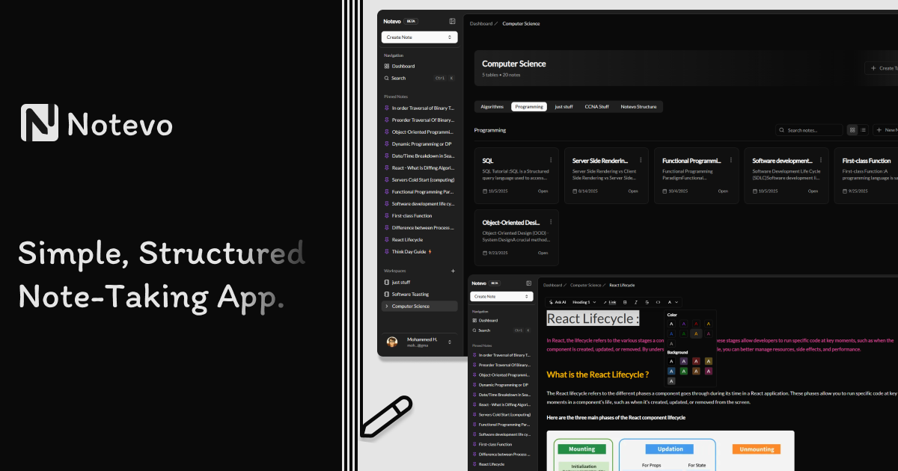

# Notevo

**NoteWise** is an AI-powered, real-time note-taking SaaS platform designed to help users create, edit, and organize their notes seamlessly. With a Notion-style WYSIWYG editor, users can enjoy a rich-text editing experience and leverage AI to improve productivity through intelligent suggestions and auto-completion.

## To Do :

[] fix the routing

[] fix the middleware

[] fix the code Highlight in the editer

[] fix the caching

[] change the rename stff in the workingspace route



## Features

- 📝 **Notion-style editor** powered by Novel
- 🤖 **AI-powered autocompletion** with OpenAI integration
- 🔄 **Real-time updates**
- 📂 **Cloud storage support with Convex**
- 🔐 **Authentication with Convex**
- 🚀 **Optimized performance** with Convex
- 🌍 **Deployed on Vercel** for seamless access

## Tech Stack

- **Frontend**:
  - Next.js (React-based framework)
  - TypeScript
  - Tailwind CSS for responsive and modern UI
- **Backend**:
  - Prisma ORM for database management
  - NeonDB for data storage "postgresql"
- **AI Integration**:
  - OpenAI API via Vercel AI SDK
- **Authentication**:
  - NextAuth for secure user login with multiple provider support
- **Deployment**:
  - Vercel for fast and scalable deployment

## Prerequisites

Before you begin, ensure you have the following installed on your machine:

- **Node.js** (version 18+)
- **npm** or **yarn**
- **NeonDB** "postgresql" database connection

## Installation

To set up NoteWise locally, follow these steps:

1. **Clone the repository:**

   ```bash
   git clone https://github.com/imohammedhamed/NoteWise.git
   ```

   ```bash
   cd NoteWise
   ```

   ```bash
   git clone https://github.com/your-username/Notevo.git
   cd Notevo
   ```

   Create a .env.local file in the root of the project and add the required environment variables:

   ```bash
     NEXT_PUBLIC_OPENAI_API_KEY=your-openai-api-key
    DATABASE_URL=your-database-url
    NEXTAUTH_URL=http://localhost:3000
    NEXTAUTH_SECRET=your-nextauth-secret
   ```

   Use Prisma to initialize your database with the required schema:

   ```bash
   git commit -m "Add feature XYZ"
   ```

   Start the development server:

   ```bash
    npm run dev
   ```

## Usage

After starting the application, you can access it in your web browser at `http://localhost:3000`. From there, you can browse the menu, select items, and place an order.
##Once NoteWise is set up, users can:

**Create and Edit Notes:** Use the WYSIWYG editor to format text, create headings, lists, links, and more.

**AI-Assisted Writing:** Get content suggestions and auto-completions based on the context of your notes.

**Auto-Save:** Notes will automatically save as you type, so you don't need to worry about losing your work.

**Breadcrumb Navigation:** Move between sections of your notes quickly with breadcrumb trails.

### User Authentication

NoteWise supports secure login via OAuth providers such as Google and GitHub, as well as email-based authentication. Once logged in, users can access their personalized notes and settings.

### Real-Time AI Suggestions

While writing, the AI will provide context-aware suggestions, improving your note-taking speed and quality. Simply click on the suggestions or allow auto-completion to assist you while writing.

### Responsive Design

NoteWise is designed to work across devices—whether you're using a desktop, tablet, or mobile phone, your experience will remain smooth and consistent.

## Contributing

We welcome contributions to the project! To contribute, follow these steps:

1. Fork the repository.
2. Create a new branch.
   ```bash
   git checkout -b feature-branch
   ```
3. Make your changes.
4. Commit your changes.
   ```bash
   git commit -m "Add some feature"
   ```
5. Push to the branch.
   ```bash
   git push origin feature-branch
   ```
6. Open a pull request.

## Getting Started

First, run the development server:

```bash
npm run dev
# or
yarn dev
# or
pnpm dev
# or
bun dev
```

Open http://localhost:3000 with your browser to see the result.

You can start editing the page by modifying app/page.tsx. The page auto-updates as you edit the file.

This project uses next/font to automatically optimize and load Inter, a custom Google Font.

## Learn More

To learn more about Next.js, take a look at the following resources:

Next.js Documentation - learn about Next.js features and API.
Learn Next.js - an interactive Next.js tutorial.
You can check out the Next.js GitHub repository - your feedback and contributions are welcome!

Deploy on Vercel
The easiest way to deploy your Next.js app is to use the Vercel Platform from the creators of Next.js.

Check out our Next.js deployment documentation for more details.

## Contact

For any questions or suggestions, feel free to reach out:

Email: mohammedhamed6726@gmail.com

GitHub: imohammedhamed

This is a [Convex](https://convex.dev/) project created with [`npm create convex`](https://www.npmjs.com/package/create-convex).

After the initial setup (<2 minutes) you'll have a working full-stack app using:

- Convex as your backend (database, server logic)
- [Convex Auth](https://labs.convex.dev/auth) for your authentication implementation
- [React](https://react.dev/) as your frontend (web page interactivity)
- [Next.js](https://nextjs.org/) for optimized web hosting and page routing
- [Tailwind](https://tailwindcss.com/) and [shadcn/ui](https://ui.shadcn.com/) for building great looking accessible UI fast

## Get started

If you just cloned this codebase and didn't use `npm create convex`, run:

```
npm install
npm run dev
```

If you're reading this README on GitHub and want to use this template, run:

```
npm create convex@latest -- -t nextjs-convexauth-shadcn
```

## The app

The app is a basic multi-user chat. Walkthrough of the source code:

- [convex/auth.ts](./convex/auth.ts) configures the available authentication methods
- [convex/messages.ts](./convex/messages.ts) is the chat backend implementation
- [middleware.ts](./middleware.ts) determines which pages require sign-in
- [app/layout.tsx](./app/layout.tsx) is the main app layout
- [app/(splash)/page.tsx](<./app/(splash)/page.tsx>) is the splash page (doesn't require sign-in)
- [app/product/layout.tsx](./app/product/layout.tsx) is the "product" layout for the [product page](./app/product/page.tsx) (requires sign-in)
- [app/signin/page.tsx](./app/signin/page.tsx) is the sign-in page
- [app/product/Chat/Chat.tsx](./app/product/Chat/Chat.tsx) is the chat frontend

## Configuring other authentication methods

To configure different authentication methods, see [Configuration](https://labs.convex.dev/auth/config) in the Convex Auth docs.

## Learn more

To learn more about developing your project with Convex, check out:

- The [Tour of Convex](https://docs.convex.dev/get-started) for a thorough introduction to Convex principles.
- The rest of [Convex docs](https://docs.convex.dev/) to learn about all Convex features.
- [Stack](https://stack.convex.dev/) for in-depth articles on advanced topics.

## Join the community

Join thousands of developers building full-stack apps with Convex:

## Deploy on Vercel

The easiest way to deploy your Next.js app is to use the [Vercel Platform](https://vercel.com/new?utm_medium=default-template&filter=next.js&utm_source=create-next-app&utm_campaign=create-next-app-readme) from the creators of Next.js.

Check out our [Next.js deployment documentation](https://nextjs.org/docs/app/building-your-application/deploying) for more details.

## Deploy on Vercel

The easiest way to deploy your Next.js app is to use the [Vercel Platform](https://vercel.com/new?utm_medium=default-template&filter=next.js&utm_source=create-next-app&utm_campaign=create-next-app-readme) from the creators of Next.js.

# Check out our [Next.js deployment documentation](https://nextjs.org/docs/deployment) for more details.

- Join the [Convex Discord community](https://convex.dev/community) to get help in real-time.
- Follow [Convex on GitHub](https://github.com/get-convex/), star and contribute to the open-source implementation of Convex.
